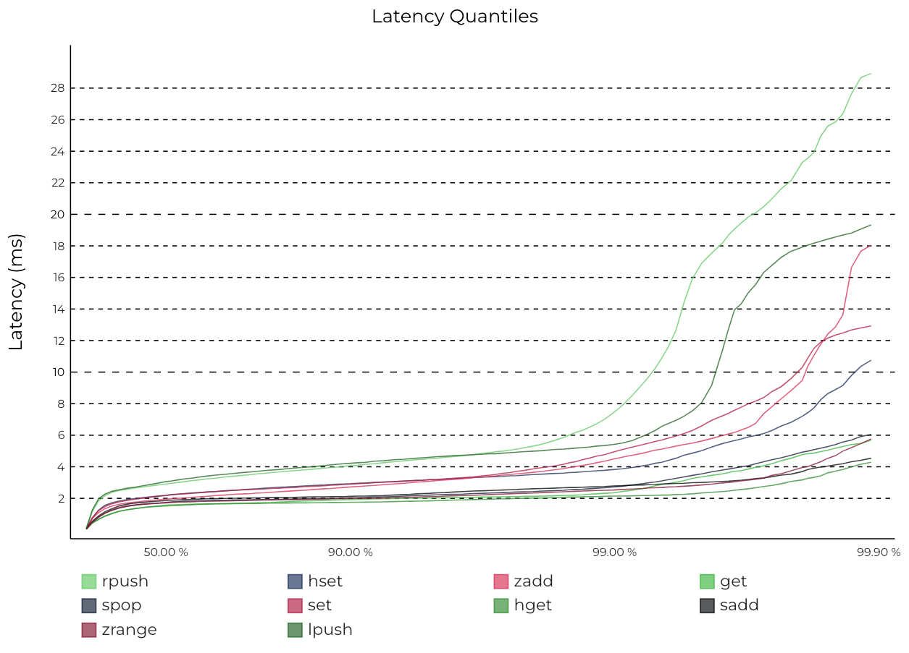
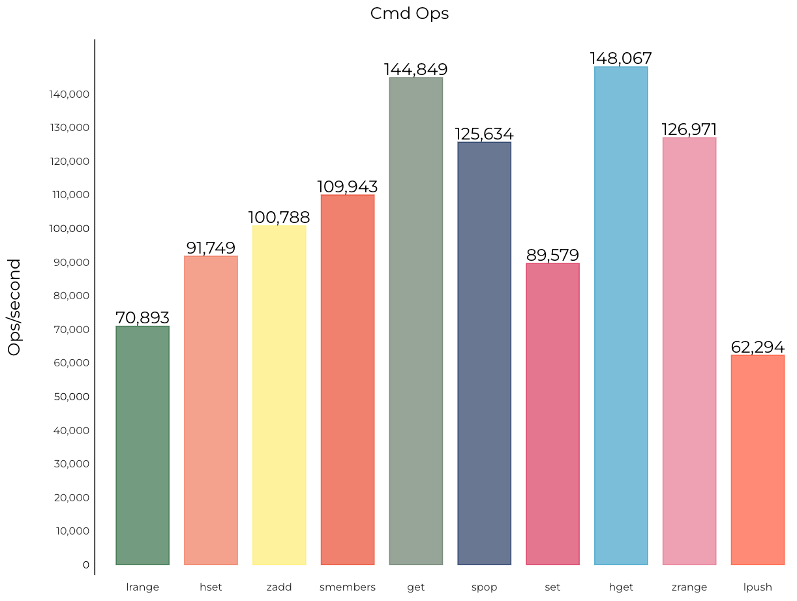
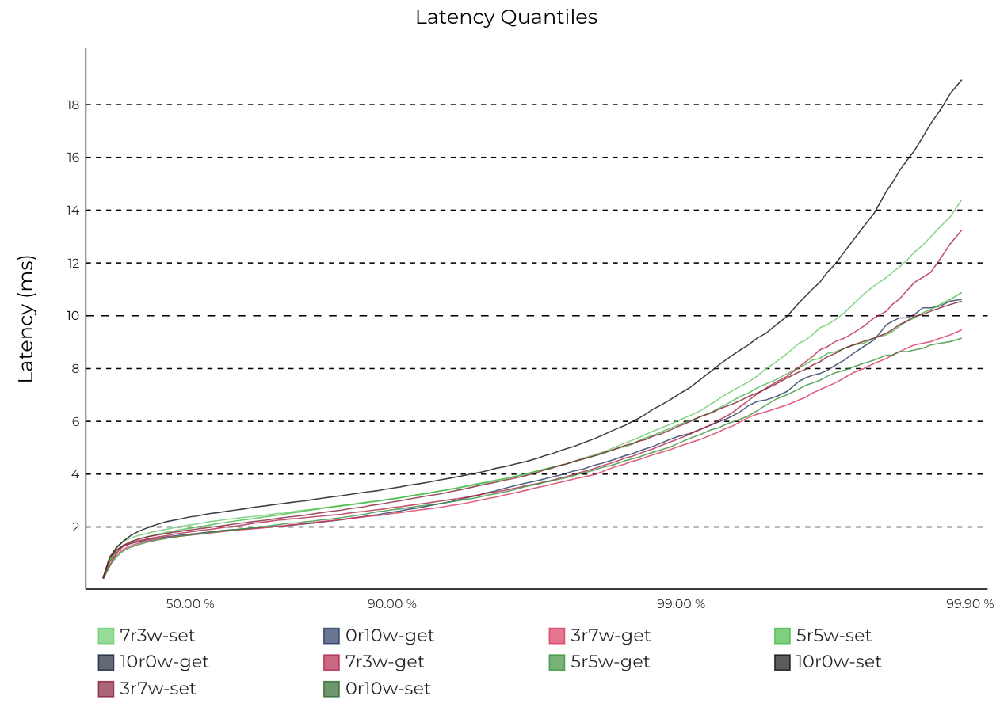
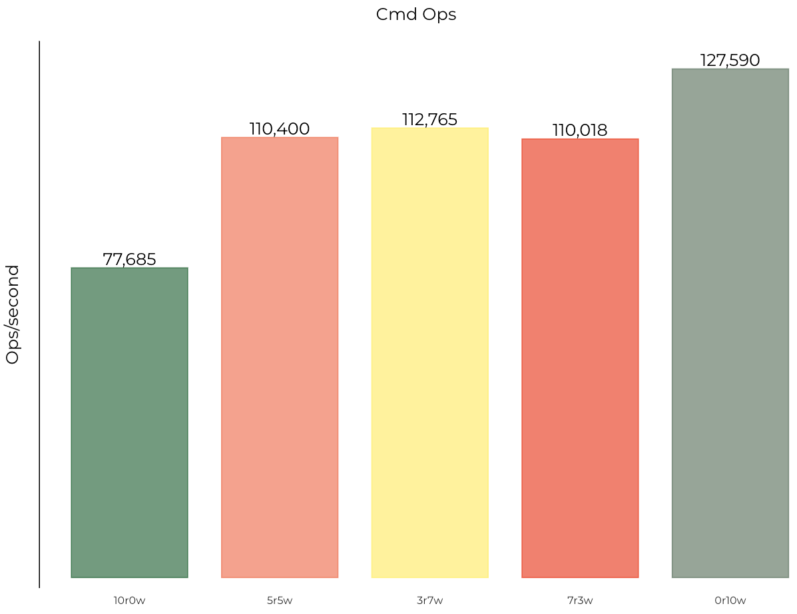

This tool provides benchmark commands for common metrics and supports generating visualized SVG charts from benchmark results with a single command, improving benchmarking efficiency. Steps are as follows:

1. The benchmark tool uses Redis's official `memtier_benchmark`, so install it first. Refer to the official documentation: [https://github.com/RedisLabs/memtier_benchmark](https://github.com/RedisLabs/memtier_benchmark).

2. Start a Pika instance, then run the benchmark script:
```shell
sh pika_benchmark.sh -host 127.0.0.1 -port 9221
```
The following test parameters are currently supported:
```shell
-host <host>       Server hostname, default: 127.0.0.1
-port <port>       Server port, default: 9221
-requests <requests>   Number of requests, default: 10000
-clients <clients>    Number of concurrent clients, default: 50
-threads <threads>    Number of threads, default: 4
-dataSize <dataSize>   Data size, default: 32
```

3. After benchmarking, parse and format the benchmark data. First run `go build` to compile the converter:
```shell
go build parser.go
```
Then run the program to format the benchmark data. If the output directory does not exist, create it manually beforehand:
```shell
mkdir -p parsed_data

./parser -in_dir=$(pwd)/bench_data -out_dir=$(pwd)/parsed_data
```

4. Use the Python script to generate chart images from the data:
```shell
sh gen_chart.sh
```
After execution, four SVG files will be generated in the `./charts` directory. Open them directly in a browser to view the results.

5. The following four benchmark charts can be automatically generated:

5.1 Percentile latency chart for common commands:



5.2 OPS chart for common commands:



5.3 Percentile latency chart for different read/write scenarios:



5.4 OPS chart for different read/write scenarios:


